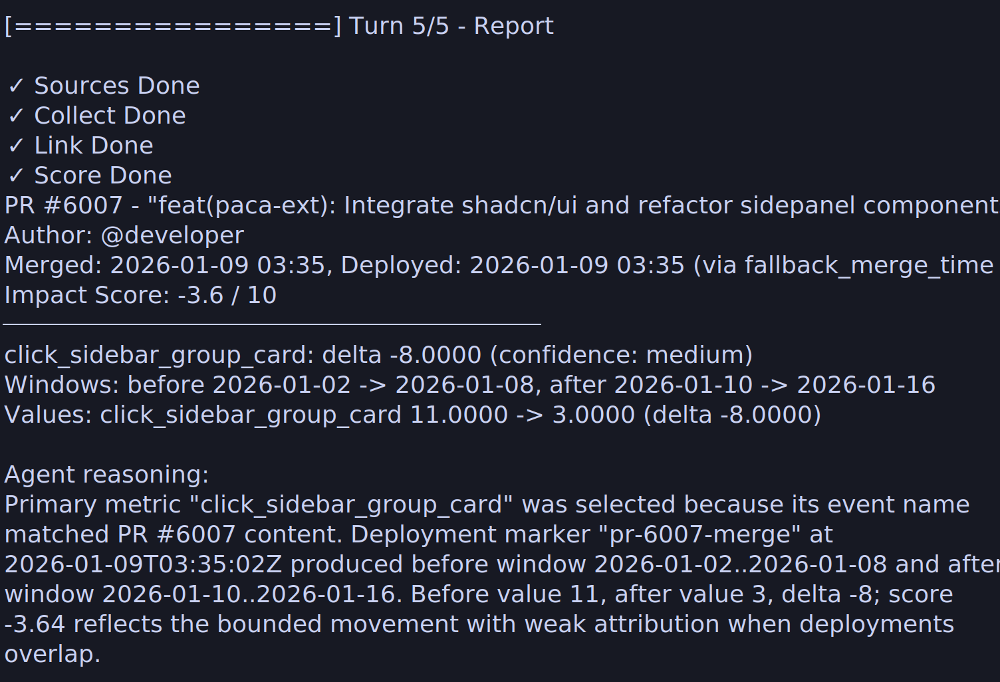

# Git Impact Analyzer

Git Impact Analyzer is a local CLI for estimating product impact from merged GitHub PRs and analytics data available through OneQuery.

It runs a phased workflow:

1. Check configured OneQuery sources.
2. Collect PR, tag, release, and changed-file data from GitHub.
3. Link PRs to deployment markers and feature groups.
4. Score impact from bounded before/after analytics windows.
5. Render an interactive report.

## Example



## Usage

```bash
./git-impact analyze --since 2026-04-01
```

Other scopes:

```bash
./git-impact analyze --pr 6054
./git-impact analyze --feature "creator_feature_request_button"
./git-impact check-sources
```

For machine-readable output:

```bash
./git-impact --output json analyze --since 2026-04-01
```

## Configuration

The CLI reads `impact-analyzer.yaml` by default:

```yaml
onequery:
  org: onequery-demo
  github_repository: owner/repo
  sources:
    github: github-source-key
    analytics: analytics-source-key
analysis:
  before_window_days: 7
  after_window_days: 7
  cooldown_hours: 0
```

Use `--config` to point at another file.

## Development

```bash
go test ./internal/gitimpact ./internal/wtl ./cmd/git-impact
```

The repo-root `./git-impact` script runs `go run ./cmd/git-impact`.
